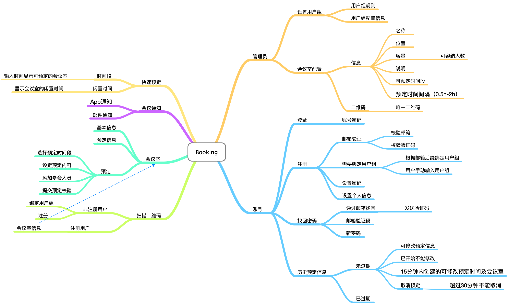

# BookMeeting

## 会议室预定
主要功能就是预定会议室

### 脑图

### 0x00 功能列表
- 注册
	- 通过公司邮箱注册
	- 发送验证邮件进行邮箱绑定
- 列出可选会议室
	- 会议室人员配置
	- 会议室名称
	- 会议室预定请求
- 预定
	- 选择会议室
	- 设定会议时间段
	- 填写会议主题
	- 可选推送消息给参会人员
- 取消预定
	- 会议未开始前可取消预定
- 修改预定 （预定会议的人或者指定主持会议的人）
	- 时间段
	- 参会人员
	- 会议主题
- 通知/拓展
	- 推送消息收到参会邀请
	- 设置会议开始时间提醒
	- 拓展显示当日/明日要参与的会议
- 线下
	- 每个会议室生成唯一二维码
	- 扫描此二维码可以进行参看和预定
	- 预定需登录
    
### 0x01 Flutter&Go
### 0x02 TODO
- [ ] 功能列表

### 0x03 完成度

- [#===========]

### 0x04 下载地址
[Download](#)

--EOF--
